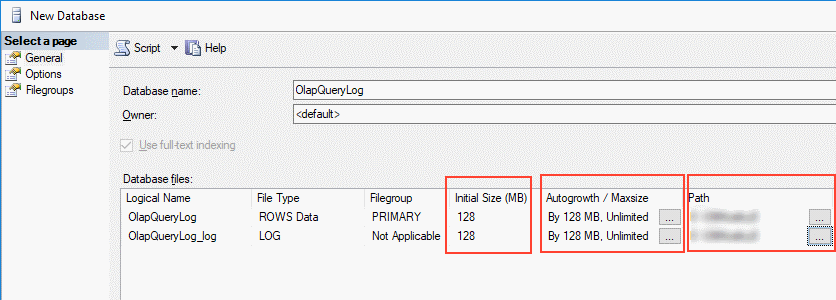
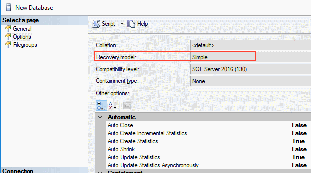
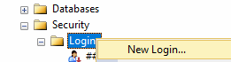
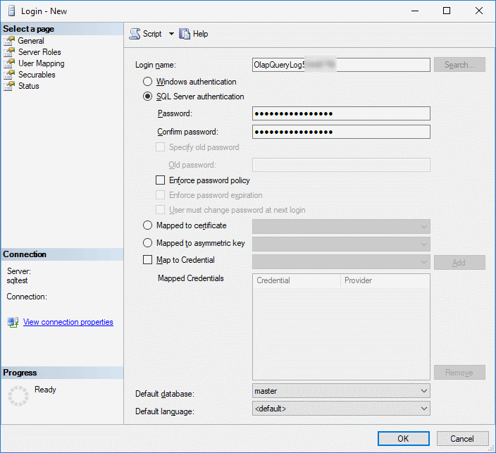
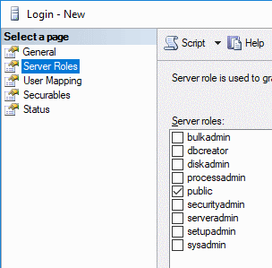
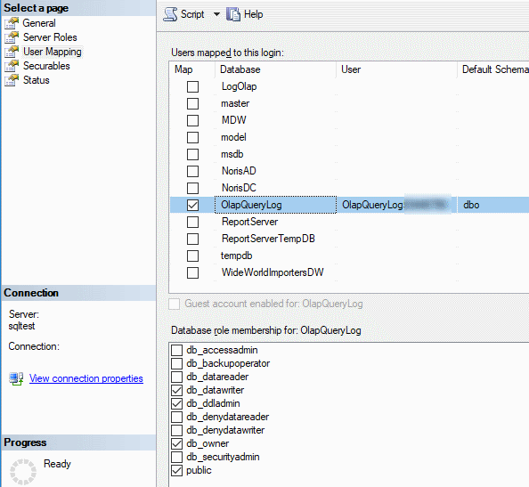
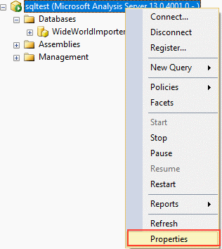
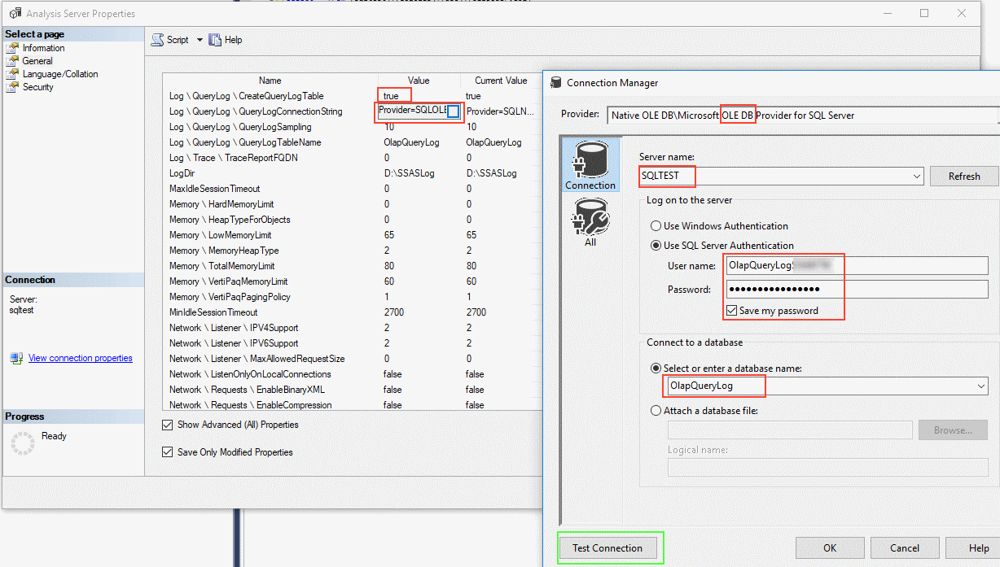
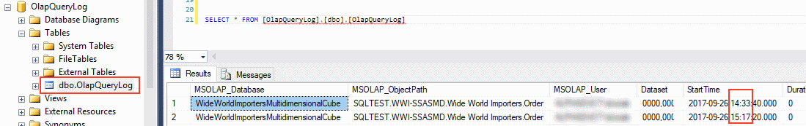
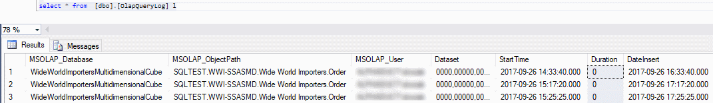

# Set up logging

## Create Database

I prefer database with same name **OlapQueryLog** on each MSSQL server. I have bad experience logging to different server.

In management studio:

 

 

I think size 128MB is enough.

 

Recovery model simple.

## Logging in SSAS

### Special user

It's better to use special user for logging. 

 

 

 

 


### Properties SSAS

 

 
  
QueryLogSampling - default is 10. Every 10th MDX is logged. I think its not realy truth. I Didnt see much differences when i tested with 1.
  
### Testing

Connect to Cube from Excel. Take some measure and dimension. Try it more then once.

Table must be created. Rows must be inserted when you refresh cube in Excel:

SELECT * FROM [OlapQueryLog].[dbo].[OlapQueryLog]


 

Watch **hour difference**! Now its 17:17, in table is 15:17! So +2 hour!

### Adding new column "DateInsert"

[Script](NewColumnDateInsert.sql) 

```SQLPL

--ADD NEW COLUMN [DateInsert] WITH DEFAULT GATDATE()
ALTER TABLE [dbo].[OlapQueryLog] ADD DateInsert [datetime] NULL
ALTER TABLE [dbo].[OlapQueryLog] ADD CONSTRAINT [DF_OlapQueryLog_DateInsert] DEFAULT (getdate()) FOR [DateInsert]

--UPDATE COLUMN [DateInsert] IF IT IS NULL
declare @Diff int 
set @Diff = DATEDIFF(hour, GetUTCDate(), GETDATE()) 
--Difference is between UNCDate and Getdate.
update l 
set l.DateInsert = DATEADD(HOUR,@Diff,StartTime) 
-- select DATEADD(HOUR,@Diff,StartTime) 
from [dbo].[OlapQueryLog] l
where l.DateInsert is null

```
Here is result:

 


## Links

* [Configuring the Analysis Services Query Log](https://technet.microsoft.com/en-us/library/cc917676.aspx)
